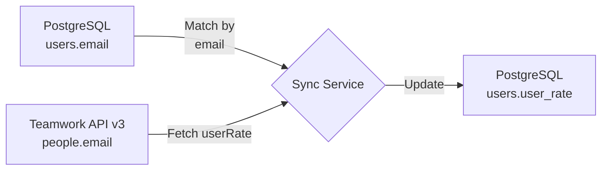

# Sync User Rates from Teamwork API v3

## Goal

Add `user_rate` (from Teamwork API v3) to the existing users in the PostgreSQL database by matching users between the database and Teamwork.

## Current State

### Database Schema (users table)

```prisma
model User {
  id              String      @id @default(cuid())
  email           String      @unique
  name            String
  google_id       String      @unique
  company_id      String?
  employee_code   String?     @db.VarChar(6)
  department_code String?     @db.VarChar(4)
  fnc_code        String?     @db.VarChar(10)
  deleted_at      DateTime?
  createdAt       DateTime    @default(now())
  updatedAt       DateTime    @updatedAt
}
```

### Teamwork API v3 User Data

```json
{
  "id": 681770,
  "firstName": "Charles",
  "lastName": "Simmons",
  "email": "charles@nearanddear.agency",
  "userRate": 43000
}
```

## Implementation Plan

### Step 1: Database Migration

Add field to the User model:

- `user_rate` (Int?) - Hourly rate in cents (e.g., 43000 = $430.00)

### Step 2: User Matching Strategy

Match users by **email address** (case-insensitive):

**Matching Process:**

1. Fetch all users from database (select id, email, name)
2. Fetch all users from Teamwork API v3
3. Create a Map of Teamwork users by lowercase email
4. For each database user, lookup by lowercase email
5. Update matched users with their `user_rate`

### Step 3: Sync Script

Create `scripts/sync-user-rates.ts`:

```typescript
// Pseudocode
async function syncUserRates() {
  // 1. Fetch all users from database
  const dbUsers = await prisma.user.findMany({
    where: { deleted_at: null },
    select: { id: true, email: true, name: true },
  });

  // 2. Fetch all users from Teamwork API v3 (with pagination)
  const teamworkUsers = await fetchAllTeamworkUsers();

  // 3. Create email -> teamwork user map (case-insensitive)
  const teamworkByEmail = new Map(
    teamworkUsers.map((u) => [u.email.toLowerCase(), u])
  );

  // 4. Match and update
  let matched = 0;
  let unmatched = 0;

  for (const dbUser of dbUsers) {
    const teamworkUser = teamworkByEmail.get(dbUser.email.toLowerCase());
    if (teamworkUser) {
      await prisma.user.update({
        where: { id: dbUser.id },
        data: {
          user_rate: teamworkUser.userRate,
        },
      });
      matched++;
    } else {
      unmatched++;
      console.log(`No match for: ${dbUser.email}`);
    }
  }

  console.log(`Sync complete: ${matched} matched, ${unmatched} unmatched`);
}
```

### Step 4: API Endpoint

Create `src/app/api/users/sync-rates/route.ts`:

- POST endpoint to trigger sync (admin only)
- Returns sync results: matched count, unmatched count, unmatched emails

### Step 5: Display in UI

Update `src/app/(dashboard)/people/page.tsx`:

- Add "Hourly Rate" column to the people table
- Format as currency (e.g., $430.00)

## Security Considerations

1. **Rate Limiting**: Teamwork API has rate limits; implement pagination and delays
2. **Admin Only**: Sync endpoint should be restricted to admin users
3. **No Exposed Keys**: API key stays server-side only

## Data Flow



## Files to Create/Modify

| File                                    | Action | Purpose                  |
| --------------------------------------- | ------ | ------------------------ |
| `prisma/schema.prisma`                  | Modify | Add user_rate field      |
| `prisma/migrations/`                    | Create | Migration for new field  |
| `scripts/sync-user-rates.ts`            | Create | One-time sync script     |
| `src/lib/teamwork-v3.ts`                | Create | API v3 client            |
| `src/app/api/users/sync-rates/route.ts` | Create | API endpoint for sync    |
| `src/app/(dashboard)/people/page.tsx`   | Modify | Display user_rate column |

## Next Steps

1. Update Prisma schema with user_rate field
2. Run migration
3. Create sync script
4. Run sync to populate rates
5. Update UI to display rates
