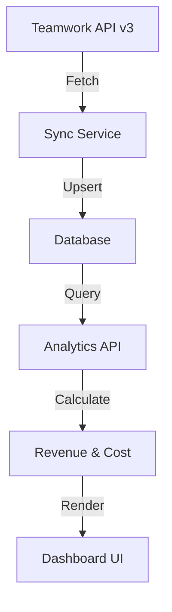

# Teamwork API v3 Integration Plan

## Overview

Based on testing the Teamwork API v3, we now have access to richer data including `userRate`, `userCost`, and currency information. This plan outlines how to integrate this data into the BurnKit app.

## API v3 Data Available

### User Data (from `/projects/api/v3/people.json`)

```json
{
  "id": 681770,
  "firstName": "Charles",
  "lastName": "Simmons",
  "email": "charles@nearanddear.agency",
  "userRate": 43000, // In cents ($430.00)
  "userRates": {
    "1": {
      "amount": 430, // In dollars
      "currency": { "id": 1, "type": "currencies" }
    }
  },
  "userCost": 26000, // In cents ($260.00)
  "company": { "id": 1399573, "type": "companies" },
  "timezone": "America/New_York",
  "createdAt": "2024-09-23T20:21:45Z",
  "updatedAt": "2026-01-25T21:34:51Z"
}
```

### Project Data (from `/projects/api/v3/projects.json`)

- Rich project metadata including status, tags, active pages
- Company references with type information
- Created/updated timestamps with user references

### Company Data (from `/projects/api/v3/companies.json`)

- Full company details including address fields
- Logo URLs
- Account/collaborator counts
- Currency information

## Current Data Model Gaps

| Current Model | Missing Fields                             | Impact                                       |
| ------------- | ------------------------------------------ | -------------------------------------------- |
| `User`        | `userRate`, `userCost`, `teamwork_user_id` | Cannot calculate profitability               |
| `time_logs`   | `hourly_rate_at_log_time`                  | Cannot calculate revenue for historical logs |
| `companies`   | `currency_id`                              | Cannot handle multi-currency                 |
| -             | No `currencies` table                      | Cannot store currency metadata               |

## Implementation Plan

### Phase 1: Database Schema Updates

1. **Add fields to `users` table:**

   - `teamwork_user_id` (Int, unique) - Link to Teamwork
   - `hourly_rate` (Int) - Store in cents (e.g., 43000 = $430.00)
   - `hourly_cost` (Int) - Store in cents
   - `currency_id` (Int) - Reference to currency
   - `timezone` (String) - User's timezone
   - `teamwork_updated_at` (DateTime) - Track sync timestamp

2. **Add fields to `time_logs` table:**

   - `hourly_rate_at_time` (Int) - Rate when log was created (for historical accuracy)
   - `calculated_revenue` (Int) - Pre-calculated revenue in cents
   - `calculated_cost` (Int) - Pre-calculated cost in cents

3. **Create `currencies` table:**
   - `id` (Int, PK) - Teamwork currency ID
   - `code` (String) - USD, EUR, etc.
   - `symbol` (String) - $, €, etc.
   - `name` (String) - US Dollar, Euro, etc.

### Phase 2: API v3 Client Layer

Create `src/lib/teamwork-v3.ts`:

```typescript
// Teamwork API v3 client
class TeamworkV3Client {
  async getPeople(page?: number): Promise<Person[]>;
  async getProjects(page?: number): Promise<Project[]>;
  async getCompanies(page?: number): Promise<Company[]>;
  async getTimeEntries(params: TimeEntryParams): Promise<TimeEntry[]>;
}
```

### Phase 3: Data Sync Service

Create `src/lib/sync/teamwork-sync.ts`:

```typescript
// Sync users with rates from Teamwork
async function syncUsersFromTeamwork(): Promise<SyncResult>;

// Sync projects from Teamwork
async function syncProjectsFromTeamwork(): Promise<SyncResult>;

// Sync companies from Teamwork
async function syncCompaniesFromTeamwork(): Promise<SyncResult>;
```

### Phase 4: Update Analytics

Modify `src/app/api/analytics/route.ts`:

- Calculate revenue: `(minutes / 60) * hourly_rate`
- Calculate cost: `(minutes / 60) * hourly_cost`
- Calculate profit: `revenue - cost`
- Add profitability metrics to response

### Phase 5: UI Updates

1. **People Page** (`src/app/(dashboard)/people/`):

   - Add "Hourly Rate" column to table
   - Add "Cost Rate" column
   - Show profit margin per person

2. **Insights Page** (`src/app/(dashboard)/insights/`):

   - Add revenue chart alongside hours
   - Add profitability metrics
   - Show cost vs revenue breakdown

3. **Matrix Page** (`src/app/(dashboard)/matrix/`):
   - Add revenue view option
   - Add cost view option
   - Toggle between hours/revenue/cost views

### Phase 6: Background Sync

Create `src/app/api/sync/teamwork/route.ts`:

- API endpoint to trigger sync
- Support for webhook-based sync from Teamwork
- Scheduled sync via Vercel Cron

## Data Flow



## Key Decisions

1. **Rate Storage**: Store rates in cents as integers to avoid floating-point issues
2. **Historical Accuracy**: Store `hourly_rate_at_time` on time_logs for accurate historical reporting
3. **Sync Strategy**: Incremental sync based on `updatedAt` timestamps
4. **Currency**: Support multi-currency from day one

## Next Steps

1. Review and approve this plan
2. Switch to Code mode to implement Phase 1 (database schema)
3. Implement API v3 client layer
4. Build sync service
5. Update analytics and UI
