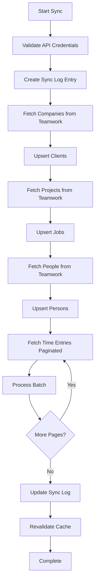

# Teamwork Integration Plan for BurnKit

## Executive Summary

This document outlines the plan to integrate Teamwork.com API with BurnKit to automatically pull time tracking data instead of relying on manual Excel file uploads. The integration will maintain the existing data structure while adding automated synchronization capabilities.

## Current State Analysis

### Existing System

- **Data Source**: Manual Excel file uploads with a "DATA" sheet
- **Data Structure**: Time entries with person, client, job, hours, dollars, and categorization
- **Categories**:
  - `billable` - Revenue-generating client work
  - `gap` - Non-billable hours on billable projects
  - `internal` - Internal operations and overhead
- **Database**: PostgreSQL with Prisma ORM using a star schema design
- **Key Entities**:
  - `Person` (dim_persons) - People who log time
  - `Client` (dim_clients) - Clients (internal and external)
  - `Job` (dim_jobs) - Jobs/projects associated with clients
  - `TimeEntry` (fact_time_entries) - Time entry records

### Data Flow

1. User uploads Excel file via drag-and-drop interface
2. [`excel-parser.ts`](src/lib/excel-parser.ts) parses the DATA sheet
3. [`import.ts`](src/actions/import.ts) processes entries and upserts dimension tables
4. Time entries are inserted in batches with import tracking
5. Dashboard displays aggregated analytics via [`data.ts`](src/actions/data.ts)

### Key Features to Preserve

- Real-time analytics with summary cards
- Person and client performance tracking
- Matrix view showing person-client relationships
- Advanced filtering (date range, department, client type)
- Billable percentage calculations
- Revenue metrics

## Teamwork API Integration

### API Overview

Teamwork.com provides a REST API for accessing project management data including:

- **Time Entries** - Logged time with user, project, task, hours, and billing status
- **Projects** - Client projects (maps to our Clients/Jobs)
- **People** - Users who log time (maps to our Persons)
- **Companies** - Client companies (maps to our Clients)
- **Tasks** - Individual tasks within projects

### Authentication

- **Method**: API Key authentication via HTTP header
- **Header**: `Authorization: Bearer {api_key}`
- **Base URL**: `https://{installation}.teamwork.com/`
- **Rate Limits**: Typically 200 requests per minute

### Required API Endpoints

#### 1. Time Entries

```
GET /time_entries.json
```

**Parameters**:

- `fromDate` - Start date (YYYY-MM-DD)
- `toDate` - End date (YYYY-MM-DD)
- `page` - Page number for pagination
- `pageSize` - Results per page (max 500)
- `includeArchivedProjects` - Include archived projects

**Response Fields**:

- `id` - Time entry ID
- `date` - Entry date
- `hours` - Hours logged
- `minutes` - Minutes logged
- `description` - Entry description
- `isBillable` - Billing status
- `userId` - User who logged time
- `projectId` - Associated project
- `taskId` - Associated task (optional)
- `companyId` - Client company

#### 2. Projects

```
GET /projects.json
```

**Response Fields**:

- `id` - Project ID
- `name` - Project name
- `companyId` - Associated company
- `status` - Active/archived status
- `isBillable` - Project billing status

#### 3. People

```
GET /people.json
```

**Response Fields**:

- `id` - User ID
- `firstName` - First name
- `lastName` - Last name
- `email` - Email address
- `userType` - Employee/contractor type

#### 4. Companies

```
GET /companies.json
```

**Response Fields**:

- `id` - Company ID
- `name` - Company name
- `isOwner` - Whether this is the owner company (internal)

## Architecture Design

### Component Structure

```
src/
├── lib/
│   ├── teamwork/
│   │   ├── client.ts           # Teamwork API client
│   │   ├── types.ts            # TypeScript types for API responses
│   │   ├── mapper.ts           # Map Teamwork data to BurnKit schema
│   │   └── sync.ts             # Synchronization logic
│   ├── excel-parser.ts         # Keep for backward compatibility
│   └── db.ts
├── actions/
│   ├── teamwork-sync.ts        # Server actions for sync
│   ├── import.ts               # Keep for Excel imports
│   └── data.ts
├── app/
│   └── (dashboard)/
│       ├── settings/
│       │   └── teamwork/
│       │       └── page.tsx    # Teamwork configuration UI
│       └── upload/
│           └── page.tsx        # Updated to support both methods
└── components/
    └── teamwork/
        ├── sync-status.tsx     # Sync status indicator
        └── config-form.tsx     # Configuration form
```

### Database Schema Updates

#### New Tables

##### 1. teamwork_config

Stores Teamwork API configuration per user/organization.

```prisma
model TeamworkConfig {
  id              Int       @id @default(autoincrement())
  userId          String    @unique
  installationUrl String    @map("installation_url")
  apiKey          String    @map("api_key") // Encrypted
  isActive        Boolean   @default(true) @map("is_active")
  lastSyncAt      DateTime? @map("last_sync_at")
  createdAt       DateTime  @default(now()) @map("created_at")
  updatedAt       DateTime  @updatedAt @map("updated_at")

  user            User      @relation(fields: [userId], references: [id])

  @@map("teamwork_config")
}
```

##### 2. teamwork_sync_log

Tracks synchronization history and status.

```prisma
model TeamworkSyncLog {
  id              Int       @id @default(autoincrement())
  userId          String    @map("user_id")
  status          SyncStatus
  startedAt       DateTime  @default(now()) @map("started_at")
  completedAt     DateTime? @map("completed_at")
  dateRangeStart  DateTime  @map("date_range_start") @db.Date
  dateRangeEnd    DateTime  @map("date_range_end") @db.Date
  entriesProcessed Int      @default(0) @map("entries_processed")
  entriesCreated  Int       @default(0) @map("entries_created")
  entriesUpdated  Int       @default(0) @map("entries_updated")
  errorMessage    String?   @map("error_message")

  user            User      @relation(fields: [userId], references: [id])

  @@map("teamwork_sync_log")
}

enum SyncStatus {
  pending
  running
  completed
  failed
}
```

##### 3. teamwork_entity_mapping

Maps Teamwork entities to BurnKit entities for tracking.

```prisma
model TeamworkEntityMapping {
  id              Int       @id @default(autoincrement())
  entityType      EntityType @map("entity_type")
  teamworkId      String    @map("teamwork_id")
  burnkitId       Int       @map("burnkit_id")
  createdAt       DateTime  @default(now()) @map("created_at")

  @@unique([entityType, teamworkId])
  @@map("teamwork_entity_mapping")
}

enum EntityType {
  person
  client
  project
  time_entry
}
```

#### Updated Tables

##### TimeEntry Updates

Add fields to track Teamwork source:

```prisma
model TimeEntry {
  // ... existing fields ...

  // New fields
  teamworkId      String?   @map("teamwork_id") @unique
  sourceType      SourceType @default(manual) @map("source_type")

  // ... existing relations ...

  @@index([teamworkId])
}

enum SourceType {
  manual    // Excel upload
  teamwork  // Teamwork sync
}
```

### Data Mapping Strategy

#### Person Mapping

```typescript
Teamwork User → BurnKit Person
- firstName + lastName → name
- userType → isFreelance (contractor = true)
- Custom field or tag → department
```

#### Client Mapping

```typescript
Teamwork Company → BurnKit Client
- name → name
- isOwner → isInternal
```

#### Job Mapping

```typescript
Teamwork Project → BurnKit Job
- id → jobNumber (prefixed with "TW-")
- name → description
- companyId → clientId (via mapping)
```

#### Time Entry Mapping

```typescript
Teamwork TimeEntry → BurnKit TimeEntry
- date → itemDate
- hours + minutes/60 → hours
- Calculate dollars based on hourly rate
- isBillable → category determination:
  * isBillable = true → "billable"
  * isBillable = false + project.isBillable = true → "gap"
  * project.isInternal = true → "internal"
- description → itemDesc
```

### Synchronization Logic

#### Sync Modes

##### 1. Full Sync

- Pull all time entries within a date range
- Upsert all persons, clients, and jobs
- Create/update time entries
- Use case: Initial setup or data refresh

##### 2. Incremental Sync

- Pull time entries modified since last sync
- Only process changed entities
- Use case: Regular scheduled syncs

##### 3. Manual Sync

- User-triggered sync for specific date range
- Provides immediate feedback
- Use case: Ad-hoc data updates

#### Sync Process Flow



#### Error Handling

- **API Errors**: Retry with exponential backoff (3 attempts)
- **Rate Limiting**: Respect 429 responses, wait and retry
- **Data Validation**: Log invalid entries, continue processing
- **Partial Failures**: Complete what's possible, log errors
- **Transaction Safety**: Use database transactions for batch operations

### API Client Implementation

#### Core Client Structure

```typescript
// src/lib/teamwork/client.ts
export class TeamworkClient {
  private baseUrl: string;
  private apiKey: string;
  private headers: Record<string, string>;

  constructor(installationUrl: string, apiKey: string);

  // Core methods
  async getTimeEntries(params: TimeEntryParams): Promise<TimeEntry[]>;
  async getProjects(): Promise<Project[]>;
  async getPeople(): Promise<Person[]>;
  async getCompanies(): Promise<Company[]>;

  // Pagination helper
  private async fetchPaginated<T>(
    endpoint: string,
    params: object
  ): Promise<T[]>;

  // Error handling
  private async handleResponse<T>(response: Response): Promise<T>;
}
```

#### Type Definitions

```typescript
// src/lib/teamwork/types.ts
export interface TeamworkTimeEntry {
  id: string;
  date: string;
  hours: number;
  minutes: number;
  description: string;
  isBillable: boolean;
  userId: string;
  projectId: string;
  taskId?: string;
  companyId: string;
}

export interface TeamworkProject {
  id: string;
  name: string;
  companyId: string;
  status: string;
  isBillable: boolean;
}

export interface TeamworkPerson {
  id: string;
  firstName: string;
  lastName: string;
  email: string;
  userType: string;
}

export interface TeamworkCompany {
  id: string;
  name: string;
  isOwner: boolean;
}
```

#### Data Mapper

```typescript
// src/lib/teamwork/mapper.ts
export class TeamworkMapper {
  static mapPerson(twPerson: TeamworkPerson): Prisma.PersonCreateInput;
  static mapClient(twCompany: TeamworkCompany): Prisma.ClientCreateInput;
  static mapJob(
    twProject: TeamworkProject,
    clientId: number
  ): Prisma.JobCreateInput;
  static mapTimeEntry(
    twEntry: TeamworkTimeEntry,
    personId: number,
    clientId: number,
    jobId: number,
    importBatchId: number
  ): Prisma.TimeEntryCreateInput;

  static categorizeEntry(
    isBillable: boolean,
    projectIsBillable: boolean,
    isInternal: boolean
  ): TimeEntryCategory;
}
```

### User Interface Updates

#### Settings Page

New page at `/settings/teamwork` for configuration:

**Features**:

- Input fields for installation URL and API key
- Test connection button
- Enable/disable toggle
- Last sync timestamp display
- Sync history table

**Components**:

- [`config-form.tsx`](src/components/teamwork/config-form.tsx) - Configuration form
- [`sync-status.tsx`](src/components/teamwork/sync-status.tsx) - Status indicator

#### Upload Page Updates

Update [`/upload/page.tsx`](<src/app/(dashboard)/upload/page.tsx>):

**Features**:

- Tab switcher: "Excel Upload" vs "Teamwork Sync"
- Excel tab: Keep existing functionality
- Teamwork tab:
  - Date range picker
  - Sync mode selector (full/incremental)
  - Sync button
  - Progress indicator
  - Sync history

#### Dashboard Updates

Add sync status indicator to header:

- Show last sync time
- Display sync status (idle/syncing/error)
- Quick sync button

### Security Considerations

#### API Key Storage

- **Encryption**: Encrypt API keys at rest using AES-256
- **Environment**: Store encryption key in environment variable
- **Access**: Only decrypt when making API calls
- **Rotation**: Support key rotation without data loss

#### Implementation

```typescript
// src/lib/crypto.ts
export function encryptApiKey(apiKey: string): string;
export function decryptApiKey(encryptedKey: string): string;
```

#### Access Control

- Only authenticated users can configure Teamwork
- API keys are user-specific
- Sync logs are user-scoped
- Admin users can view all sync logs

### Performance Optimization

#### Caching Strategy

- Cache Teamwork entity mappings in memory
- Use Redis for distributed caching (optional)
- Cache API responses for 5 minutes
- Invalidate cache on sync completion

#### Batch Processing

- Process time entries in batches of 500
- Use Prisma batch operations (`createMany`, `updateMany`)
- Implement progress tracking for large syncs
- Allow cancellation of long-running syncs

#### Database Optimization

- Add indexes on `teamworkId` fields
- Use database transactions for consistency
- Implement connection pooling
- Monitor query performance

### Monitoring and Logging

#### Logging Strategy

- Log all API calls with timing
- Log sync start/completion with metrics
- Log errors with full context
- Use structured logging (JSON format)

#### Metrics to Track

- Sync duration
- Entries processed per sync
- API call count and latency
- Error rate
- Data freshness (time since last sync)

#### Alerting

- Alert on sync failures
- Alert on API rate limit hits
- Alert on data validation errors
- Alert on stale data (no sync in 24h)

## Implementation Phases

### Phase 1: Foundation

**Goal**: Set up basic Teamwork API integration

**Tasks**:

1. Create Teamwork API client library
2. Implement authentication and basic API calls
3. Add database schema for configuration
4. Create encryption utilities for API keys
5. Build configuration UI

**Deliverables**:

- Working API client
- Configuration page
- Encrypted credential storage

### Phase 2: Data Synchronization

**Goal**: Implement core sync functionality

**Tasks**:

1. Build data mapper for all entity types
2. Implement sync service with full sync mode
3. Add sync logging and tracking
4. Create entity mapping system
5. Build sync UI in upload page

**Deliverables**:

- Full sync capability
- Sync history tracking
- Basic error handling

### Phase 3: Advanced Features

**Goal**: Add incremental sync and optimization

**Tasks**:

1. Implement incremental sync mode
2. Add scheduled sync capability
3. Optimize batch processing
4. Implement caching layer
5. Add progress indicators

**Deliverables**:

- Incremental sync
- Scheduled syncs
- Performance optimizations

### Phase 4: Polish and Monitoring

**Goal**: Production-ready system

**Tasks**:

1. Add comprehensive error handling
2. Implement monitoring and alerting
3. Add sync status dashboard
4. Write documentation
5. Perform load testing

**Deliverables**:

- Production-ready system
- Monitoring dashboard
- User documentation

## Migration Strategy

### Backward Compatibility

- Keep Excel upload functionality intact
- Support mixed data sources (Excel + Teamwork)
- Add `sourceType` field to distinguish entries
- Allow filtering by source type

### Data Migration

- No migration needed for existing data
- New syncs create new entries
- Historical Excel data remains unchanged
- Users can continue using Excel if preferred

### Rollout Plan

1. **Beta Testing**: Enable for select users
2. **Validation**: Compare Excel vs Teamwork data
3. **Gradual Rollout**: Enable for all users
4. **Monitoring**: Track adoption and issues
5. **Optimization**: Refine based on feedback

## Testing Strategy

### Unit Tests

- API client methods
- Data mapper functions
- Encryption/decryption
- Categorization logic

### Integration Tests

- Full sync flow
- Incremental sync flow
- Error handling scenarios
- API rate limiting

### End-to-End Tests

- Configuration setup
- Manual sync trigger
- Data validation
- Dashboard display

### Performance Tests

- Large dataset sync (10k+ entries)
- Concurrent sync requests
- API rate limit handling
- Database query performance

## Risk Assessment

### Technical Risks

| Risk               | Impact | Likelihood | Mitigation                                                 |
| ------------------ | ------ | ---------- | ---------------------------------------------------------- |
| API rate limits    | High   | Medium     | Implement rate limiting, caching, and retry logic          |
| Data inconsistency | High   | Low        | Use transactions, validation, and reconciliation           |
| API changes        | Medium | Low        | Version API client, monitor Teamwork changelog             |
| Performance issues | Medium | Medium     | Optimize queries, implement caching, batch processing      |
| Security breach    | High   | Low        | Encrypt keys, audit access, follow security best practices |

### Business Risks

| Risk                | Impact | Likelihood | Mitigation                                               |
| ------------------- | ------ | ---------- | -------------------------------------------------------- |
| User adoption       | Medium | Medium     | Maintain Excel option, provide training, gradual rollout |
| Data accuracy       | High   | Low        | Validation checks, comparison tools, user feedback       |
| Teamwork dependency | Medium | Low        | Keep Excel as backup, monitor Teamwork status            |

## Success Metrics

### Technical Metrics

- Sync success rate > 99%
- Average sync time < 2 minutes for 1000 entries
- API error rate < 1%
- Zero data loss incidents

### Business Metrics

- User adoption rate > 80%
- Reduction in manual data entry time > 90%
- User satisfaction score > 4/5
- Support ticket reduction > 50%

## Documentation Requirements

### Developer Documentation

- API client usage guide
- Data mapping reference
- Sync process flow diagrams
- Troubleshooting guide

### User Documentation

- Configuration setup guide
- Sync operation guide
- FAQ and common issues
- Video tutorials

## Appendix

### Environment Variables

```env
# Teamwork Integration
TEAMWORK_ENCRYPTION_KEY=<32-byte-hex-string>
TEAMWORK_SYNC_INTERVAL=3600  # seconds (1 hour)
TEAMWORK_BATCH_SIZE=500
TEAMWORK_MAX_RETRIES=3
TEAMWORK_TIMEOUT=30000  # milliseconds
```

### API Rate Limits

- Standard: 200 requests/minute
- Burst: 400 requests/minute
- Daily: 10,000 requests/day

### Useful Resources

- [Teamwork API Documentation](https://apidocs.teamwork.com/)
- [Teamwork API v3 Migration Guide](https://apidocs.teamwork.com/guides/teamwork/migration-guide)
- [Teamwork Webhooks](https://apidocs.teamwork.com/guides/teamwork/webhooks)

---

**Document Version**: 1.0  
**Last Updated**: 2026-01-27  
**Author**: Architecture Team  
**Status**: Draft for Review
